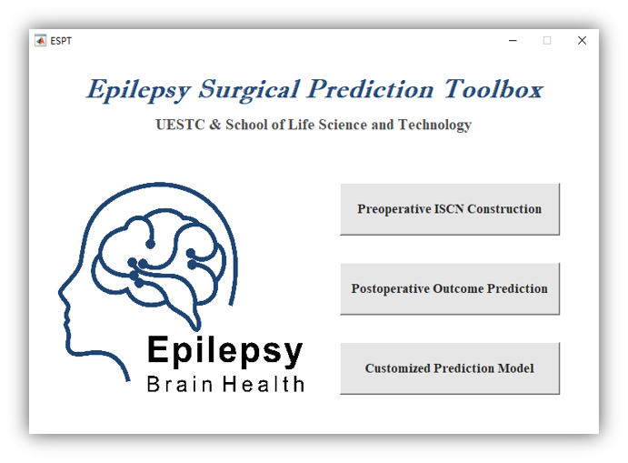
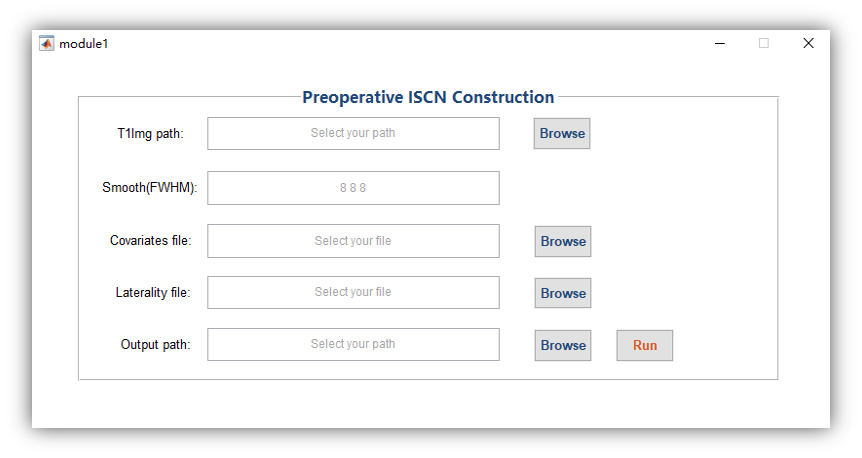
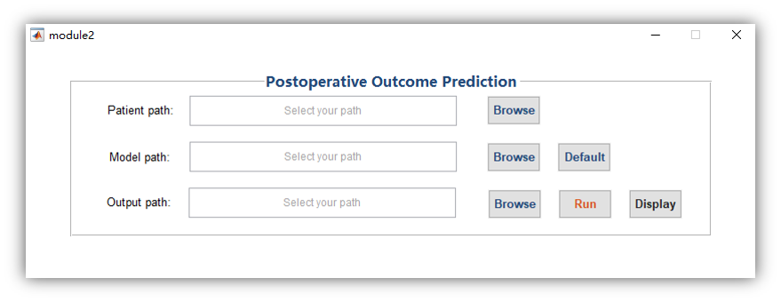
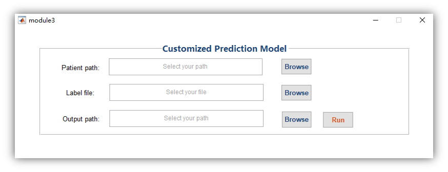

# ESPT

ESPT is a lightweight toolbox for predicting surgical outcomes of medial temporal lobe epilepsy based on individual structural covariance network. The current version of ESPT is available in  MATLAB. 

## Installation

This toolbox has been tested with MATLAB versions R2018. ESPT can be installed by downloading and unzipping the code from Github and add to the search path. 

## Dependencies

To user EPST, the following packages are required:

- SPM12
- libsvm

Libsvm is in the ESPT file.

## Start

Enter "ESPT" in the command to enter the start screen of the software, as shown in the figure below. 

## Preoperative ISCN Construction

### T1Img path

Click the "Browse" button on the right and select the subject's T1Img folder. Please note that the selected folder must be named T1Img, otherwise the program will not recognize it.

### Covariates file

Select the excel file that stores covariates. The first column is the age of the subject, and the second column is the gender of the subject (male: 0; Woman: 1), as shown.

|  40  |  0   |
| :--: | :--: |
|  16  |  1   |
|  33  |  1   |

### Laterality file

Choose to store the excel file of the subject's seizure side, 0 represents the left side, 1 represents the right side, as shown.

|  0   |
| :--: |
|  1   |
|  1   |

### Output path

Click the "Browse" button on the right, select a folder to store the output, and select an empty folder.

After completing the above steps, click the "Run" button on the right to start the task, where splitting can take a lot of time. And it outputs each person's individual structural covariance network.

## Postoperative Outcome Prediction

### Patient path

Click the "Browse" button on the right and select the folder to store the subject individual structure covariance network matrix (the output folder of front module).

### Model path

Two options to select the prediction model. (1) Click the "Browse" button on the right and select the folder where your trained model resides; (2) Click the "Default" button on the right to automatically load the model of the software. 

### Output path

Click the "Browse" button on the right, select a folder to store the result.

After the above steps are completed, click the "Run" button on the right to start the task. Wait for the program to finish running and open the output folder. The output of this module consists of two parts: (1) The excel document of the predicted probability for each subject, the first column is the subject name, and the second column is the predicted probability of seizure free; (2) The first 20 outliers of each subject were returned to the brain and saved as nii format for auxiliary diagnosis. Click the "Display" button on the right to open the mricron software for visualizing nii files.

## Customized Prediction Model

### Patient path

Click the "Browse" button on the right and select the folder to store the subject individual structure covariance network matrix (the output folder of Module 1).

### Label file

Choose to store the excel file of whether the subject is seizure free or no seizure free, the format is shown in the figure, 0 represents seizure free, 1 represents no seizure free.

### Output path

Click the "Browse" button on the right, select a folder to store the output.

After completing the above steps, click the Run button on the right to start the task. Wait for the program to finish running and open the output folder. The output of this module has two folders, `model.mat` is the user-trained prediction model, and `index.mat` is the feature number filtered out by the model. Users can select this folder in the second module.
